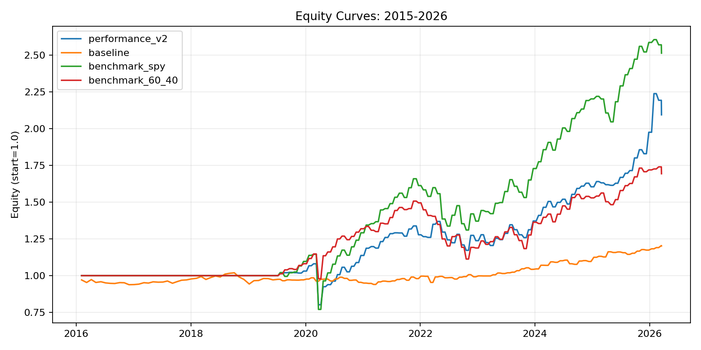
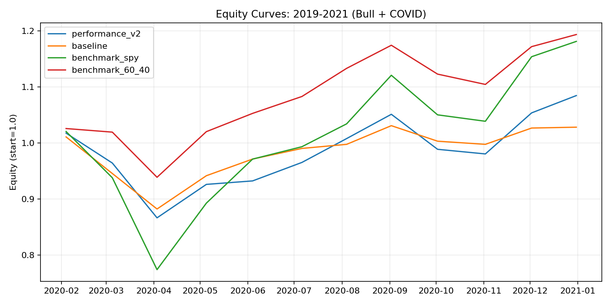
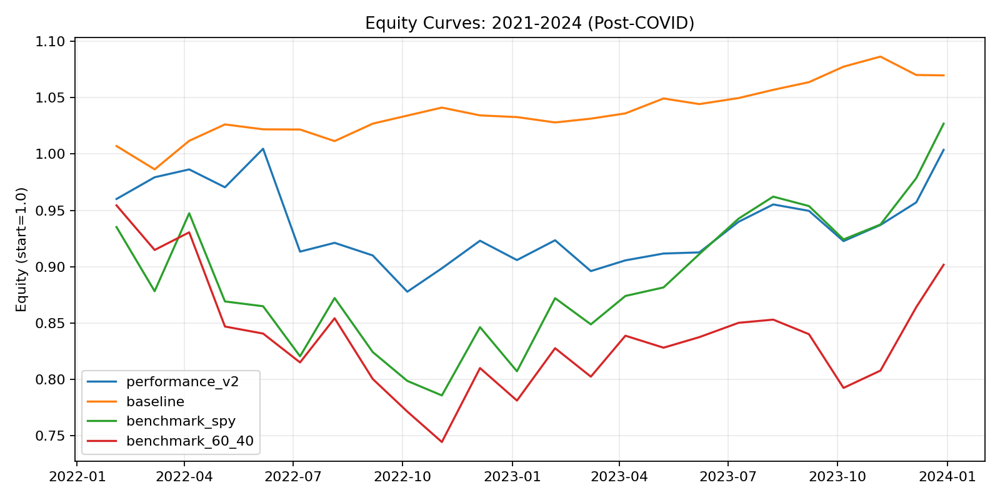
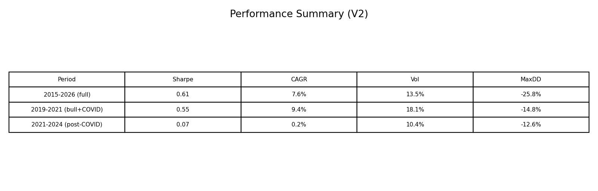
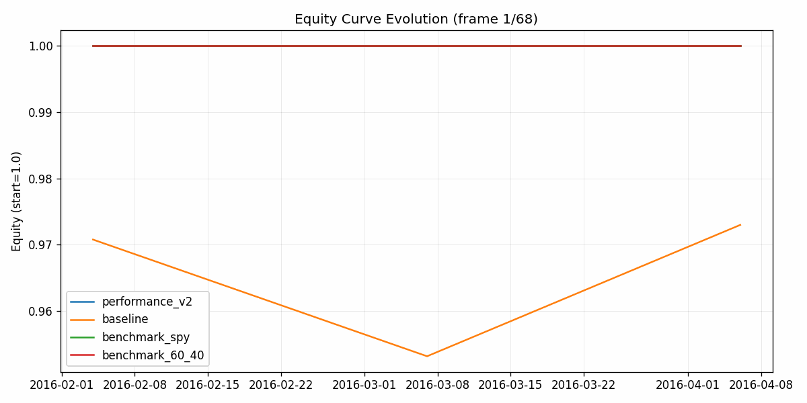
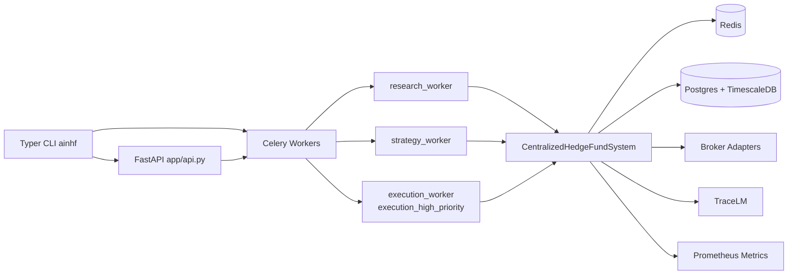

# 🧠 AI-Native Hedge Fund Prototype

> **Free, portable, open-source** — A production-grade multi-agent trading system with backtesting, paper execution, and full audit infrastructure. No paid APIs required.

[](https://www.python.org/)
[](LICENSE)
[](tests/)
[](https://pypi.org/project/tracelm/)
[](https://alpaca.markets/)

-----

## 📈 Backtest Performance

> Long-only cross-sectional momentum + trend following · 28-ETF universe · Monthly rebalance
> **Paper trading only. Not financial advice.**

|Period                            |Sharpe|CAGR |Vol  |Max DD|
|----------------------------------|------|-----|-----|------|
|**2015–2026** (full)              |0.61  |7.6% |13.5%|-25.8%|
|**2019–2021** (bull + COVID crash)|0.55  |9.4% |18.1%|-14.8%|
|**2021–2024** (post-COVID)        |0.07  |0.2% |10.4%|-12.6%|
|**SPY buy-and-hold** (same period)|~0.63 |~9.5%|—    |—     |

### Equity Curves

|Full Period (2015–2026)                                |Bull + COVID (2019–2021)                               |
|-------------------------------------------------------|-------------------------------------------------------|
|||

|Post-COVID (2021–2024)                                       |Performance Summary                                                |
|-------------------------------------------------------------|-------------------------------------------------------------------|
|||



-----

## ✨ What Makes This Different

- **Fully free** — yfinance for data, Ollama for local LLM, Alpaca paper for execution. Zero paid APIs.
- **Multi-agent architecture** — 15+ specialized agents across research, strategy, risk, and execution.
- **Production-grade reliability** — circuit breakers, dead-man heartbeat, hash-chained audit logs, TraceLM tracing.
- **Deployable anywhere** — Docker, Render, Railway, Oracle Always Free, or GitHub Actions (zero infra).
- **Hackable and auditable** — every decision is logged, traceable, and reproducible.

-----

## 🏗️ Architecture

### Live Runtime (`free_fund/orchestrator.py`)

```
Data Ingest
  → Data Quality Gate
  → Research Agent
  → Strategy Ensemble
  → Alpha / Arbitrage / Private / Council Overlays
  → Regime + Benchmark-Relative Adjustment
  → Fund Manager
  → Risk Manager
  → Execution Controls
  → Broker Router (Alpaca / Zerodha / Upstox / Stub)
  → Audit + Tracing + Heartbeat
```

### AI-Native v2 (`scripts/backtest_ai_native_v2.py`, backtest only)

```
Baseline Orchestrator Weights
  → Regime Meta-Router
  → AI Forecast + Calibration
  → Benchmark-Relative Optimizer
  → No-Harm Guards
  → Weight Override for Evaluation
```

### Enterprise Runtime Diagram (New)



### Enterprise Addendum (New)

- Package/runtime moved to **Python 3.11 + `uv` + `pyproject.toml`**.
- Config layer upgraded to **Pydantic Settings v2** with nested env overrides using `__`.
- API endpoints added: **`/healthz`**, **`/metrics`**, **`/decision`** (`app/api.py`).
- Queue split with Celery workers: `research_worker`, `strategy_worker`, `execution_worker`.
- DB stack added: SQLAlchemy 2 + Alembic, Postgres/Timescale schema for `audit_events` and `ohlcv`.
- Tracing is now a **hard TraceLM dependency** (no silent fallback path).
- Feature flags added via Redis-backed `feature_enabled()` in `free_fund/flags.py`.

-----

## 🤖 Agents

**Data & Research**

- **Market/Data Agent** — OHLCV via yfinance
- **Research Agent** — Deterministic RSS headline analysis; optional LangChain + local Ollama overlay
- **Research Council (LLM-native)** — researcher / news / peer / synthesis multi-agent ranking with bounded tool-using loops

**Strategy**

- **Strategy Agents** — trend, mean reversion, volatility carry, regime switching, event-driven
- **Alpha Pipeline** — earnings momentum, analyst revisions, options IV term-structure proxy, volume/liquidity shock, short-interest proxy, block-deal proxy
- **Cross-Asset Arbitrage** — NSE/BSE arb hook, cash-futures basis, ETF NAV arb, ADR arb hook
- **Macro Intelligence** — RBI policy hook, global carry, crude-gold correlation, rupee regime

**Risk & Execution**

- **Adaptive Learning** — Bayesian-style weight drift and decay updates
- **Fund Manager** — combines strategy scores into target weights
- **Risk Manager** — hard clamps, volatility scaling, drawdown brake, VaR/ES, beta-neutrality band
- **Execution Agent** — broker failover router, TWAP/VWAP-style slicing, ADV impact cap, session guards
- **Audit Agent** — hash-linked immutable event log with DB persistence
- **Resilience Layer** — circuit breakers, retries/backoff, degraded mode, dead-man heartbeat

-----

## ⚡ Quick Start

```bash
# 1. Clone and set up environment
git clone https://github.com/td-02/ai-native-hedge-fund.git
cd ai-native-hedge-fund
uv sync --all-extras

# 2. Configure environment
cp .env.example .env   # Windows: copy .env.example .env

# 3. Run a dry-run decision cycle (no orders placed)
uv run ainhf run --config configs/default.yaml

# 4. Run the dashboard
uv run streamlit run app/streamlit_app.py
```

**Required** (for live paper execution):

```
APCA_API_KEY_ID=...
APCA_API_SECRET_KEY=...
```

**Optional:** `APCA_PAPER_BASE_URL` (defaults to `https://paper-api.alpaca.markets`)

-----

## 🧪 Backtest

```bash
# Standard backtest
uv run python scripts/run_backtest.py --config configs/default.yaml

# Fast orchestrator backtest (cached replay, no LLM/RSS calls)
uv run python scripts/backtest_orchestrator_stack.py \
  --config configs/backtest_fast.yaml --fast-mode \
  --from-date 2020-01-01 --to-date 2026-03-01 \
  --step-days 5 --max-cycles 0

# AI-native v2 benchmark comparison
uv run python scripts/backtest_ai_native_v2.py \
  --config configs/backtest_fast.yaml \
  --from-date 2020-01-01 --to-date 2026-03-01 \
  --step-days 5 --max-cycles 60 \
  --out outputs/ai_native_v2_compare

# Walk-forward auto-tuning
uv run python scripts/optimize_walkforward.py \
  --config configs/backtest_fast.yaml \
  --from-date 2020-01-01 --to-date 2026-03-01 --step-days 5

# Signal ablation
uv run python scripts/run_ablation.py \
  --config configs/backtest_fast.yaml --fast-mode \
  --from-date 2020-01-01 --to-date 2026-03-01 \
  --step-days 5 --max-cycles 40
```

**v2 backtest outputs:**

Nanoback-backed backtest:
`nanoback` is my own PyPI package and these runners use it directly.
```bash
uv run python scripts/run_nanoback_backtest.py --config configs/default.yaml --policy minimum_variance --out outputs/nanoback_backtest
```

Nanoback ETF universe comparison against benchmarks:
```bash
uv run python scripts/run_nanoback_etf_compare.py --config configs/performance_v2.yaml --out outputs/nanoback_etf_compare
```

AI-native v2 benchmark-relative comparison (baseline vs v2 vs benchmarks):
```bash
uv run python scripts/backtest_ai_native_v2.py --config configs/backtest_fast.yaml --from-date 2020-01-01 --to-date 2026-03-01 --step-days 5 --max-cycles 60 --out outputs/ai_native_v2_compare
```
Outputs:
- `outputs/ai_native_v2_compare/comparison_metrics.csv`
- `outputs/ai_native_v2_compare/baseline/*`
- `outputs/ai_native_v2_compare/ai_native_v2/*`

**v2 safety behavior:** deterministic fallback when LLM is unavailable; objective gate (keeps baseline if risk-adjusted active objective ≤ 0); rolling no-harm guard in backtest loop.

-----

## 🔄 Live Trading

```bash
# Single decision cycle (dry run)
uv run ainhf run --config configs/default.yaml

# Realtime loop with worker stack
uv run ainhf worker --queues research,strategy,execution_high_priority --concurrency 1

# API service
uv run ainhf api --host 0.0.0.0 --port 8000
```

> **Keep `execution.broker: stub` during testing.** Switch to Alpaca only when ready.

-----

## 📊 Dashboard

```bash
uv run streamlit run app/streamlit_app.py
```

Shows backtest metrics & equity curve, latest live decision, and audit event tail.

-----

## 🚀 Deployment

### Docker (local or any VM)

```bash
docker compose up --build
```

### Oracle Always Free (24/7 cloud — recommended)

```bash
chmod +x deploy/oracle/install.sh
./deploy/oracle/install.sh
```

See `deploy/oracle/README.md` for full guide.

### Zero-Infra Free Hosting (Render / Railway)

Pre-configured files included: `render.yaml`, `railway.json`, `Procfile`, `deploy/free-hosting.md`.

> Note: free-tier platforms may pause/sleep workloads — not guaranteed 24/7.

### GitHub Actions (India market hours, truly free)

Runs every 15 minutes on weekdays, checks IST market window (09:15–15:30) and NSE holidays before executing.

```bash
# Workflow:  .github/workflows/india-market-paper.yml
# Script:    scripts/run_if_india_market_open.py
# Holidays:  configs/market/nse_holidays.txt
```

Add `APCA_API_KEY_ID` and `APCA_API_SECRET_KEY` as GitHub Actions secrets for paper execution.

-----

## 🔍 Auditability & Reliability

**Audit trail:**

|Artifact                    |Location                              |
|----------------------------|--------------------------------------|
|Audit event log             |Postgres table `audit_events`         |
|Latest decision snapshot    |`outputs/last_decision.json`          |
|Heartbeat (dead-man switch) |Redis key `ainhf:heartbeat`           |
|TraceLM span traces         |`outputs/traces/trace_<id>.json`      |
|TraceLM SQLite DB           |`tracelm_traces.db`                   |
|OHLCV store                 |Postgres/Timescale table `ohlcv`      |

**Reliability controls:** circuit breakers per stage (`research` / `strategy` / `regime` / `risk`), data quality gate (staleness, NaN ratio, return outliers, invalid prices), alerts for stage failures/disagreement/PnL drift/dead-man triggers, Celery retries with `acks_late=True`.

-----

## 🔌 MCP Research Tools Server

Built-in MCP server exposes research tools to external clients:

|Tool                       |Description                               |
|---------------------------|------------------------------------------|
|`news_snapshot`            |Latest headlines per symbol               |
|`price_stats`              |OHLCV stats snapshot                      |
|`peer_compare`             |Cross-asset peer comparison               |
|`macro_snapshot`           |Macro indicator snapshot                  |
|`decision_preview`         |Preview next cycle decision               |
|`research_sprint`          |Ranked idea generator with action labels  |
|`research_committee_prompt`|MCP prompt template for committee workflow|

```bash
# HTTP transport
uv run python scripts/run_mcp_server.py --config configs/default.yaml \
  --host 127.0.0.1 --port 8000 --transport streamable-http

# SSE transport
uv run python scripts/run_mcp_server.py --transport sse
```

-----

## 🧾 TraceLM (Execution Tracing)

This project uses [**TraceLM**](https://pypi.org/project/tracelm/) (`pip install tracelm`) — a tracing layer for LLM execution observability and replay diagnostics, built alongside this system.

```yaml
# configs/default.yaml
tracing:
  enabled: true
```

```bash
uv run ainhf run --config configs/live_stub.yaml
tracelm list   # inspect generated traces
```

-----

## 🧪 Tests & Health

```bash
uv run pytest -q                   # run all tests
uv run python scripts/healthcheck.py  # check system health
```

-----

## 📁 Project Structure

```
free_fund/          # Core orchestrator, agents, risk, execution
scripts/            # Backtest, live, ablation, optimization, MCP server
configs/            # YAML configs (default, live_stub, backtest_fast, market)
app/                # Streamlit dashboard + FastAPI app
deploy/             # Docker, Oracle, free-hosting configs
outputs/            # Decision snapshots, traces, backtest outputs, media
tests/              # Test suite
alembic/            # DB migrations
```

-----

## 🗺️ Roadmap / Contributing

Areas where contributions are welcome:

- [ ] Additional alpha signals (PRs welcome!)
- [ ] Wire v2 AI-native layer into live `run_cycle`
- [ ] More broker integrations (Interactive Brokers, Fyers)
- [ ] Better regime detection (HMM, change-point detection)
- [ ] Web-based dashboard (React / FastAPI)
- [ ] Improved walk-forward parameter stability

See <CONTRIBUTING.md> to get started. Issues labeled `good first issue` are a great entry point.

-----

## ⚠️ Disclaimer

This is a **research prototype** for paper trading and educational purposes only. Backtested results do not guarantee future performance. **Not financial advice.** Always use `execution.broker: stub` unless you understand the risks of live paper execution.

-----

## 📄 License

MIT — free to use, fork, and build on.

