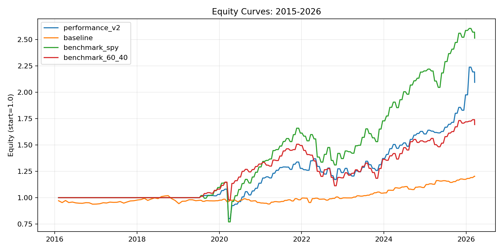
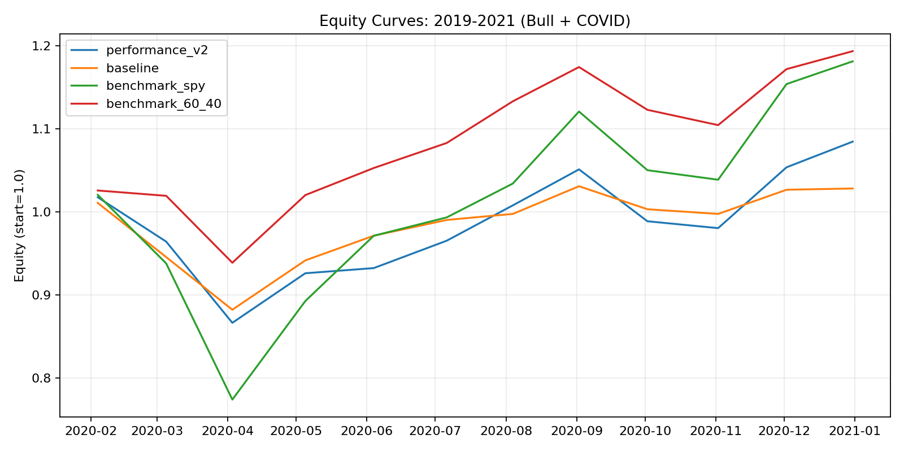
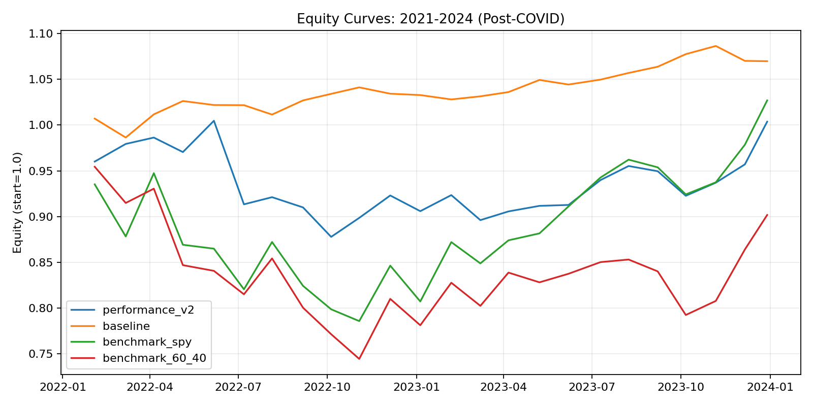
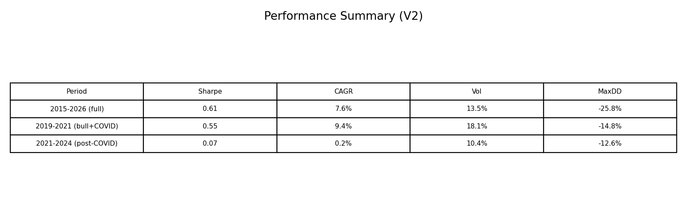
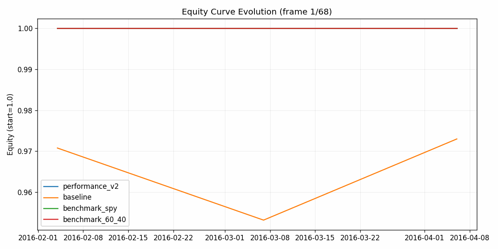
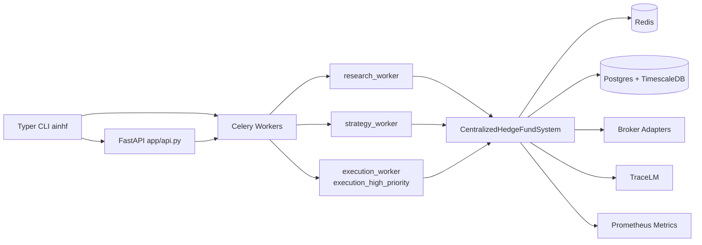
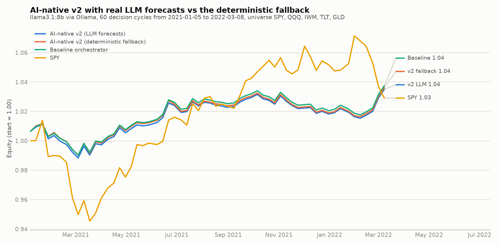
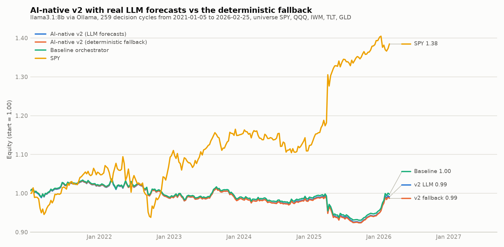

# 🧠 AI-Native Hedge Fund Prototype

> **Free, portable, open-source** — A production-grade multi-agent trading system with backtesting, paper execution, and full audit infrastructure. No paid APIs required.

[](https://www.python.org/)
[](LICENSE)
[](tests/)
[](https://pypi.org/project/tracelm/)
[](https://alpaca.markets/)

-----

## 📈 Backtest Performance

> Long-only cross-sectional momentum + trend following · 28-ETF universe · Monthly rebalance
> **Paper trading only. Not financial advice.**

|Period                            |Sharpe|CAGR |Vol  |Max DD|
|----------------------------------|------|-----|-----|------|
|**2015–2026** (full)              |0.61  |7.6% |13.5%|-25.8%|
|**2019–2021** (bull + COVID crash)|0.55  |9.4% |18.1%|-14.8%|
|**2021–2024** (post-COVID)        |0.07  |0.2% |10.4%|-12.6%|
|**SPY buy-and-hold** (same period)|~0.63 |~9.5%|—    |—     |

### Equity Curves

|Full Period (2015–2026)                                |Bull + COVID (2019–2021)                               |
|-------------------------------------------------------|-------------------------------------------------------|
|||

|Post-COVID (2021–2024)                                       |Performance Summary                                                |
|-------------------------------------------------------------|-------------------------------------------------------------------|
|||



-----

## ✨ What Makes This Different

- **Fully free** — yfinance for data, Ollama for local LLM, Alpaca paper for execution. Zero paid APIs.
- **Multi-agent architecture** — 15+ specialized agents across research, strategy, risk, and execution.
- **Production-grade reliability** — circuit breakers, dead-man heartbeat, hash-chained audit logs, TraceLM tracing.
- **Deployable anywhere** — Docker, Render, Railway, Oracle Always Free, or GitHub Actions (zero infra).
- **Hackable and auditable** — every decision is logged, traceable, and reproducible.

-----

## 🏗️ Architecture

### Live Runtime (`free_fund/orchestrator.py`)

```
Data Ingest
  → Data Quality Gate
  → Research Agent
  → Strategy Ensemble
  → Alpha / Arbitrage / Private / Council Overlays
  → Regime + Benchmark-Relative Adjustment
  → Fund Manager
  → Risk Manager
  → Execution Controls
  → Broker Router (Alpaca / Zerodha / Upstox / Stub)
  → Audit + Tracing + Heartbeat
```

### AI-Native v2 (`scripts/backtest_ai_native_v2.py`, backtest only)

```
Baseline Orchestrator Weights
  → Regime Meta-Router
  → AI Forecast + Calibration
  → Benchmark-Relative Optimizer
  → No-Harm Guards
  → Weight Override for Evaluation
```

### Enterprise Runtime Diagram (New)


```mermaid
flowchart LR
  CLI[Typer CLI ainhf] --> API[FastAPI app/api.py]
  CLI --> CEL[Celery Workers]
  API --> CEL
  CEL --> RQ[research_worker]
  CEL --> SQ[strategy_worker]
  CEL --> EQ[execution_worker<br/>execution_high_priority]
  RQ --> ORCH[CentralizedHedgeFundSystem]
  SQ --> ORCH
  EQ --> ORCH
  ORCH --> REDIS[(Redis)]
  ORCH --> PG[(Postgres + TimescaleDB)]
  ORCH --> BRK[Broker Adapters]
  ORCH --> TR[TraceLM]
  ORCH --> MET[Prometheus Metrics]
```

### Enterprise Addendum (New)

- Package/runtime moved to **Python 3.11 + `uv` + `pyproject.toml`**.
- Config layer upgraded to **Pydantic Settings v2** with nested env overrides using `__`.
- API endpoints added: **`/healthz`**, **`/metrics`**, **`/decision`** (`app/api.py`).
- Queue split with Celery workers: `research_worker`, `strategy_worker`, `execution_worker`.
- DB stack added: SQLAlchemy 2 + Alembic, Postgres/Timescale schema for `audit_events` and `ohlcv`.
- Tracing is now a **hard TraceLM dependency** (no silent fallback path).
- Feature flags added via Redis-backed `feature_enabled()` in `free_fund/flags.py`.

-----

## 🤖 Agents

**Data & Research**

- **Market/Data Agent** — OHLCV via yfinance
- **Research Agent** — Deterministic RSS headline analysis; optional LangChain + local Ollama overlay
- **Research Council (LLM-native)** — researcher / news / peer / synthesis multi-agent ranking with bounded tool-using loops

**Strategy**

- **Strategy Agents** — trend, mean reversion, volatility carry, regime switching, event-driven
- **Alpha Pipeline** — earnings momentum, analyst revisions, options IV term-structure proxy, volume/liquidity shock, short-interest proxy, block-deal proxy
- **Cross-Asset Arbitrage** — NSE/BSE arb hook, cash-futures basis, ETF NAV arb, ADR arb hook
- **Macro Intelligence** — RBI policy hook, global carry, crude-gold correlation, rupee regime

**Risk & Execution**

- **Adaptive Learning** — Bayesian-style weight drift and decay updates
- **Fund Manager** — combines strategy scores into target weights
- **Risk Manager** — hard clamps, volatility scaling, drawdown brake, VaR/ES, beta-neutrality band
- **Execution Agent** — broker failover router, TWAP/VWAP-style slicing, ADV impact cap, session guards
- **Audit Agent** — hash-linked immutable event log with DB persistence
- **Resilience Layer** — circuit breakers, retries/backoff, degraded mode, dead-man heartbeat

-----

## ⚡ Quick Start

```bash
# 1. Clone and set up environment
git clone https://github.com/td-02/ai-native-hedge-fund.git
cd ai-native-hedge-fund
uv sync --all-extras

# 2. Configure environment
cp .env.example .env   # Windows: copy .env.example .env

# 3. Run a dry-run decision cycle (no orders placed)
uv run ainhf run --config configs/default.yaml

# 4. Run the dashboard
uv run streamlit run app/streamlit_app.py
```

**Required** (for live paper execution):

```
APCA_API_KEY_ID=...
APCA_API_SECRET_KEY=...
```

**Optional:** `APCA_PAPER_BASE_URL` (defaults to `https://paper-api.alpaca.markets`)

-----

## 🧪 Backtest

```bash
# Standard backtest
uv run python scripts/run_backtest.py --config configs/default.yaml

# Fast orchestrator backtest (cached replay, no LLM/RSS calls)
uv run python scripts/backtest_orchestrator_stack.py \
  --config configs/backtest_fast.yaml --fast-mode \
  --from-date 2020-01-01 --to-date 2026-03-01 \
  --step-days 5 --max-cycles 0

# AI-native v2 benchmark comparison
uv run python scripts/backtest_ai_native_v2.py \
  --config configs/backtest_fast.yaml \
  --from-date 2020-01-01 --to-date 2026-03-01 \
  --step-days 5 --max-cycles 60 \
  --out outputs/ai_native_v2_compare

# Walk-forward auto-tuning
uv run python scripts/optimize_walkforward.py \
  --config configs/backtest_fast.yaml \
  --from-date 2020-01-01 --to-date 2026-03-01 --step-days 5

# Signal ablation
uv run python scripts/run_ablation.py \
  --config configs/backtest_fast.yaml --fast-mode \
  --from-date 2020-01-01 --to-date 2026-03-01 \
  --step-days 5 --max-cycles 40
```

**v2 backtest outputs:**

Nanoback-backed backtest:
`nanoback` is my own PyPI package and these runners use it directly.
```bash
uv run python scripts/run_nanoback_backtest.py --config configs/default.yaml --policy minimum_variance --out outputs/nanoback_backtest
```

Nanoback ETF universe comparison against benchmarks:
```bash
uv run python scripts/run_nanoback_etf_compare.py --config configs/performance_v2.yaml --out outputs/nanoback_etf_compare
```

AI-native v2 benchmark-relative comparison (baseline vs v2 vs benchmarks):
```bash
uv run python scripts/backtest_ai_native_v2.py --config configs/backtest_fast.yaml --from-date 2020-01-01 --to-date 2026-03-01 --step-days 5 --max-cycles 60 --out outputs/ai_native_v2_compare
```
Outputs:
- `outputs/ai_native_v2_compare/comparison_metrics.csv`
- `outputs/ai_native_v2_compare/baseline/*`
- `outputs/ai_native_v2_compare/ai_native_v2/*`

**v2 safety behavior:** deterministic fallback when LLM is unavailable; objective gate (keeps baseline if risk-adjusted active objective ≤ 0); rolling no-harm guard in backtest loop.

-----

## 🔄 Live Trading

```bash
# Single decision cycle (dry run)
uv run ainhf run --config configs/default.yaml

# Realtime loop with worker stack
uv run ainhf worker --queues research,strategy,execution_high_priority --concurrency 1

# API service
uv run ainhf api --host 0.0.0.0 --port 8000
```

> **Keep `execution.broker: stub` during testing.** Switch to Alpaca only when ready.

-----

## 📊 Dashboard

```bash
uv run streamlit run app/streamlit_app.py
```

Shows backtest metrics & equity curve, latest live decision, and audit event tail.

-----

## 🚀 Deployment

### Docker (local or any VM)

```bash
docker compose up --build
```

### Oracle Always Free (24/7 cloud — recommended)

```bash
chmod +x deploy/oracle/install.sh
./deploy/oracle/install.sh
```

See `deploy/oracle/README.md` for full guide.

### Zero-Infra Free Hosting (Render / Railway)

Pre-configured files included: `render.yaml`, `railway.json`, `Procfile`, `deploy/free-hosting.md`.

> Note: free-tier platforms may pause/sleep workloads — not guaranteed 24/7.

### GitHub Actions (India market hours, truly free)

Runs every 15 minutes on weekdays, checks IST market window (09:15–15:30) and NSE holidays before executing.

```bash
# Workflow:  .github/workflows/india-market-paper.yml
# Script:    scripts/run_if_india_market_open.py
# Holidays:  configs/market/nse_holidays.txt
```

Add `APCA_API_KEY_ID` and `APCA_API_SECRET_KEY` as GitHub Actions secrets for paper execution.

-----

## 🔍 Auditability & Reliability

**Audit trail:**

|Artifact                    |Location                              |
|----------------------------|--------------------------------------|
|Audit event log             |Postgres table `audit_events`         |
|Latest decision snapshot    |`outputs/last_decision.json`          |
|Heartbeat (dead-man switch) |Redis key `ainhf:heartbeat`           |
|TraceLM span traces         |`outputs/traces/trace_<id>.json`      |
|TraceLM SQLite DB           |`tracelm_traces.db`                   |
|OHLCV store                 |Postgres/Timescale table `ohlcv`      |

**Reliability controls:** circuit breakers per stage (`research` / `strategy` / `regime` / `risk`), data quality gate (staleness, NaN ratio, return outliers, invalid prices), alerts for stage failures/disagreement/PnL drift/dead-man triggers, Celery retries with `acks_late=True`.

-----

## 🔌 MCP Research Tools Server

Built-in MCP server exposes research tools to external clients:

|Tool                       |Description                               |
|---------------------------|------------------------------------------|
|`news_snapshot`            |Latest headlines per symbol               |
|`price_stats`              |OHLCV stats snapshot                      |
|`peer_compare`             |Cross-asset peer comparison               |
|`macro_snapshot`           |Macro indicator snapshot                  |
|`decision_preview`         |Preview next cycle decision               |
|`research_sprint`          |Ranked idea generator with action labels  |
|`research_committee_prompt`|MCP prompt template for committee workflow|

```bash
# HTTP transport
uv run python scripts/run_mcp_server.py --config configs/default.yaml \
  --host 127.0.0.1 --port 8000 --transport streamable-http

# SSE transport
uv run python scripts/run_mcp_server.py --transport sse
```

-----

## 🧾 TraceLM (Execution Tracing)

This project uses [**TraceLM**](https://pypi.org/project/tracelm/) (`pip install tracelm`) — a tracing layer for LLM execution observability and replay diagnostics, built alongside this system.

```yaml
# configs/default.yaml
tracing:
  enabled: true
```

```bash
uv run ainhf run --config configs/live_stub.yaml
tracelm list   # inspect generated traces
```

-----

## 🧪 Tests & Health

```bash
uv run pytest -q                   # run all tests
uv run python scripts/healthcheck.py  # check system health
```

-----

## 📁 Project Structure

```
free_fund/          # Core orchestrator, agents, risk, execution
scripts/            # Backtest, live, ablation, optimization, MCP server
configs/            # YAML configs (default, live_stub, backtest_fast, market)
app/                # Streamlit dashboard + FastAPI app
deploy/             # Docker, Oracle, free-hosting configs
outputs/            # Decision snapshots, traces, backtest outputs, media
tests/              # Test suite
alembic/            # DB migrations
```

-----

## 🗺️ Roadmap / Contributing

Areas where contributions are welcome:

- [ ] Additional alpha signals (PRs welcome!)
- [ ] Wire v2 AI-native layer into live `run_cycle`
- [ ] More broker integrations (Interactive Brokers, Fyers)
- [ ] Better regime detection (HMM, change-point detection)
- [ ] Web-based dashboard (React / FastAPI)
- [ ] Improved walk-forward parameter stability

See <CONTRIBUTING.md> to get started. Issues labeled `good first issue` are a great entry point.

-----

## ⚠️ Disclaimer

This is a **research prototype** for paper trading and educational purposes only. Backtested results do not guarantee future performance. **Not financial advice.** Always use `execution.broker: stub` unless you understand the risks of live paper execution.

-----

## 📄 License

MIT — free to use, fork, and build on.

-----

## 🧠 AI-Native Benchmark (LLM paths switched on)

> Run on 2026-09-29 with a local `llama3.1:8b` served by Ollama 0.34.4 on an Apple M5 (24 GB). Paper research only. **Not financial advice.**

### Why this run is different from the tables above

The "AI-native" layers are wired in, but every shipped config takes the deterministic path:

- `backtest.fast_mode: true` makes `run_cycle` skip the LLM research council (`{"mode": "disabled_or_fast_backtest"}`).
- `ai_native_v2.use_llm_forecasts: false` everywhere, so `generate_ai_forecasts` returns the momentum fallback (`source: deterministic_fallback`).
- `ainhf run` goes through the slim service pipeline (`runtime.pipeline_mode`), which never calls the council.
- `configs/backtest_fast.yaml` has no `ai_native_v2` block, so the v2 command above compared the baseline against itself.
- Even with Ollama up, the council prompt was a bare JSON blob: `llama3.1:8b` echoed it back until the 200-token cap, so every conviction parsed to 0.0 and the research overlay's sentiment never parsed either. Both prompts now put the instruction in a system message and reject replies without the expected keys.

The preset `configs/ai_native_llm.yaml` turns all of it on, and `scripts/benchmark_ai_native.py` probes every LLM call and exits non-zero unless the model actually answered, so these numbers cannot come from the fallback path.

```bash
ollama serve
ollama pull llama3.1:8b
uv run python scripts/benchmark_ai_native.py --config configs/ai_native_llm.yaml \
  --from-date 2020-01-01 --to-date 2026-03-01 --step-days 5 --max-cycles 60 \
  --out outputs/ai_native_llm_benchmark
```

### Setup

- Model: `llama3.1:8b` served locally by Ollama 0.34.4 on Apple M5 (24.0 GB).
- Window: price data 2020-01-01 to 2026-03-01; one decision every 5 trading days, 60 decision cycles from 2021-01-05 to 2022-03-08; universe SPY, QQQ, IWM, TLT, GLD.
- Config: `configs/ai_native_llm.yaml` (LLM forecasts on, research council on, full orchestrator).

### Backtest comparison, 60 decision cycles (the README v2 command)

| Variant | Sharpe | CAGR | Vol | Max DD | Total return | Avg turnover |
|---|---|---|---|---|---|---|
| Baseline orchestrator (no v2 overlay) | 2.60 | +16.7% | 6.0% | -2.1% | +3.7% | 0.09 |
| AI-native v2, LLM forecasts (Ollama) | 2.40 | +15.6% | 6.1% | -2.3% | +3.5% | 0.11 |
| AI-native v2, deterministic fallback | 2.49 | +16.1% | 6.1% | -2.1% | +3.6% | 0.11 |
| SPY | 0.94 | +12.8% | 13.9% | -6.8% | +2.9% | n/a |
| Equal weight | 0.62 | +7.0% | 12.1% | -7.0% | +1.6% | n/a |

### LLM usage, 60 decision cycles (proof the AI path ran)

| Variant | LLM calls | Answered by LLM | Forecast source | Provider | Latency p50 / p95 | Wall clock |
|---|---|---|---|---|---|---|
| AI-native v2, LLM forecasts (Ollama) | 300 | 300 | llm: 300 | ollama: 300 | 3.09 s / 3.41 s | 15.3 min |
| AI-native v2, deterministic fallback | 0 | 0 | deterministic_fallback: 300 | none | 0.00 s / 0.00 s | 0.2 min |

### Live decision cycle with the LLM research council

15 council calls (3 roles x 5 symbols), 15 answered by the LLM, latency p50 3.31 s, cycle wall clock 55 s with council vs 2 s without.

| Symbol | Researcher | News analyst | Peer reviewer | Council score | Weight, council on | Weight, council off |
|---|---|---|---|---|---|---|
| SPY | +0.20 | +0.60 | +0.70 | +0.500 | 0.233 | 0.235 |
| QQQ | +0.30 | +0.40 | +0.60 | +0.433 | 0.129 | 0.128 |
| IWM | -0.50 | +0.20 | +0.20 | -0.033 | 0.035 | 0.036 |
| TLT | -0.80 | -0.80 | -0.80 | -0.800 | -0.209 | -0.206 |
| GLD | -0.70 | -0.50 | -0.60 | -0.600 | -0.195 | -0.194 |



### Full-period run (every cycle)

Same preset and model, every available decision cycle: decisions from 2021-01-05 to 2026-02-25 (259 cycles, 1295 forecast calls, 67 min of local inference).

#### Backtest comparison, full period

| Variant | Sharpe | CAGR | Vol | Max DD | Total return | Avg turnover |
|---|---|---|---|---|---|---|
| Baseline orchestrator (no v2 overlay) | 0.01 | -0.3% | 8.1% | -10.3% | -0.3% | 0.09 |
| AI-native v2, LLM forecasts (Ollama) | -0.07 | -0.9% | 8.1% | -10.6% | -0.9% | 0.11 |
| AI-native v2, deterministic fallback | -0.12 | -1.3% | 8.1% | -10.8% | -1.3% | 0.11 |
| SPY | 1.71 | +37.3% | 19.7% | -14.3% | +38.5% | n/a |
| Equal weight | 2.38 | +41.5% | 15.1% | -9.3% | +42.9% | n/a |

#### LLM usage, full period

| Variant | LLM calls | Answered by LLM | Forecast source | Provider | Latency p50 / p95 | Wall clock |
|---|---|---|---|---|---|---|
| AI-native v2, LLM forecasts (Ollama) | 1295 | 1295 | llm: 1295 | ollama: 1295 | 3.08 s / 3.68 s | 67.3 min |
| AI-native v2, deterministic fallback | 0 | 0 | deterministic_fallback: 1295 | none | 0.00 s / 0.00 s | 0.8 min |



### Reading the numbers

- **The AI path really ran.** 300 forecast calls in the 60-cycle run, 1,295 in the full-period run and all 15 council calls were answered by `llama3.1:8b`; the cloud providers in `llm_router.py` (Groq, Gemini, OpenRouter) failed instantly on missing keys and Ollama answered every time. The deterministic variant made zero LLM calls. Forecast samples are in `outputs/ai_native_llm_benchmark*/llm_usage.json`; the council transcripts and the on/off decisions are in `council_live_cycle.json` and in the audit ledger.
- **The LLM forecasts do not add alpha over the baseline in either window.** On the 60 decision days (January 2021 to March 2022) the LLM variant trailed the baseline by 0.20 Sharpe and its own deterministic fallback by 0.09 (2.31 and 2.40 in two separate runs against 2.60). Over the full period (259 decision days, January 2021 to February 2026) the baseline is flat at 0.01, the LLM variant sits at -0.07 and the deterministic fallback at -0.12, so the LLM flavour edges the fallback there but both remain below the weights they tilt.
- **Why the effect is small either way.** The v2 overlay only tilts weights when its objective is positive and the last ten cycles were not underperforming; those no-harm guards left the baseline weights untouched on 49 of 60 and 228 of 259 cycles for the LLM variant. When it did act, the average absolute weight change was 0.01 to 0.03 and turnover rose from 0.09 to 0.11 per cycle. The 8B model only sees three summary statistics per ticker (20-day mean, 5-day mean, volatility) and answers with low confidence (0.3 to 0.42) and tiny expected returns, so the layer mostly re-expresses momentum with extra noise and extra trading cost.
- **The bigger finding is about the baseline, not the LLM.** In the 60-cycle window all three strategy variants beat SPY and equal weight on risk-adjusted terms (Sharpe 2.4 to 2.6 at 6% volatility against 0.94 and 0.62 at 12 to 14%). Over the full period the same five-ETF orchestrator lost 0.3% with a 10% drawdown while SPY and equal weight made 38% and 43% on the same sampled days. That early window is not representative, and an AI layer that tilts weights by a few percent cannot rescue a signal stack that is flat.
- **The council is live but light-touch.** Its convictions are coherent across the three roles and match the headlines it fetched (TLT at -0.80 during a bond sell-off, SPY at +0.50), but at `blend_weight: 0.10` it moved the final weights by at most 0.003 after the fund-manager and risk stages. It costs about 53 s per live cycle on this laptop (15 calls at 3.3 s); the forecast layer costs 3.1 s per ticker per cycle, so the full-period run was 67 minutes of local inference.

### Caveats

- Metrics are exactly what the project's `backtest_ai_native_v2.py` computes: only the trading day after each decision is counted (about one day in five), for the strategies and the benchmarks alike, and Sharpe/CAGR are annualised with 252 over those days. Comparisons are like-for-like, but the absolute returns are not full-period buy-and-hold numbers.
- The v2 LLM forecasts are point-in-time (the prompt only sees trailing return statistics from the backtest window). The research council's tools fetch *current* prices and headlines, so the council is benchmarked on a live cycle rather than inside the backtest.
- A local 8B model at temperature 0.1 is not deterministic; re-running will move the LLM variant slightly.
- Prices are pulled from yfinance at run time and the feed is not bit-stable: the same deterministic run repeated 15 minutes apart differed in the sixth decimal of the weights, so the baseline row can drift at the fourth decimal between runs.
- Two fixes were needed to get here: the three backtest scripts were missing `from pathlib import Path` (they crashed when writing results), and an empty reply from the LLM router was being tagged `source: llm` instead of falling back.
